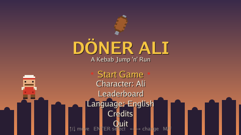
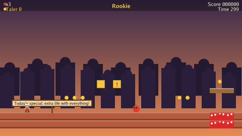
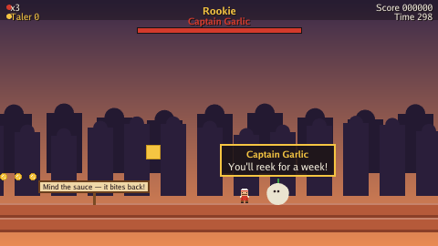

# DÖNER ALI 🥙

**A humorous 16-bit pixel-art jump 'n' run, built in Go with [Ebitengine](https://ebitengine.org).**

The brothers **Ali** and **Mehmet** work in the döner shop of their father **Achmet**.
One day Achmet vanishes — all that's left is a half-eaten dürüm and a note:
*"Help! The Giant Dürüm rolled me up!"* Ali sets out through three crazy worlds
to save his dad.

> **Enjoying the game? ⭐ Star this repo on GitHub — it really helps!**
> <https://github.com/anpiex12/kebab-ali>



| Gameplay | Boss fight |
|---|---|
|  |  |

---

## Features

- 🎮 **Three levels, each with its own boss** — the Imbiss, the Grand Bazaar and
  the Sauce Factory, ending at Captain Garlic, the Onion Twins and the
  three-phase Giant Dürüm.
- 🥙 **Döner-spit power-ups** (Rookie → Chef → Master, who throws spinning meat
  slices), rare **Ayran** invincibility, golden **taler** (100 = extra life).
- 🌶️ Original enemies: rolling tomatoes, hopping onion rings, chili-shooting
  peperoni, gliding cucumbers — and deadly **döner-sauce lakes** instead of lava.
- 👥 **Two playable brothers** (Ali & Mehmet, with different jump/speed stats).
- 🏆 **Local Top-10 leaderboard** with name entry, saved to your user config dir.
- 🌍 **English / German** UI, switchable in the menu and remembered.
- 🔊 Fully **procedural chiptune** music & sound effects (mute with **M**).
- 📦 A single, self-contained binary — **no installer, no external files.**

Every name, character, sprite, sound and melody is **original** and generated in
code or authored for this game. Nothing is taken from any other title.

## Controls

| Action | Keys |
|---|---|
| Move | ← → or **A** / **D** |
| Run | **Shift** |
| Jump (hold for higher) | **Space**, **W** or ↑ |
| Throw meat slice (Master Ali) | **X** or **J** |
| Pause | **Esc** |
| Mute | **M** |
| Fullscreen | **F** |
| Menus | ↑ ↓ move · ← → change · **Enter** select |

## Download & play

No installation required — grab the binary for your platform from the
[**Releases**](https://github.com/anpiex12/kebab-ali/releases) page and run it.

### Windows
Download `doener-ali-windows-amd64.exe` and double-click it.

### Linux
```bash
chmod +x doener-ali-linux-amd64
./doener-ali-linux-amd64
```

### macOS
No pre-built macOS binary is published — build it from source (see below). It
runs great on both Apple Silicon and Intel Macs.

Each release ships a `*.sha256` checksum next to every binary so you can verify
your download.

## Build from source

Requires **Go 1.25+**. On Linux you also need Ebitengine's build dependencies
(OpenGL/X11/ALSA headers):

```bash
# Linux only:
sudo apt-get install -y libgl1-mesa-dev xorg-dev libasound2-dev \
  libxi-dev libxcursor-dev libxinerama-dev libxrandr-dev libxxf86vm-dev pkg-config

git clone https://github.com/anpiex12/kebab-ali
cd kebab-ali
go run .            # play
go build -o doener-ali .   # produce a single binary
```

Run the tests:

```bash
go test ./...
```

## Project layout

```
kebab-ali/
├── main.go              # entry point, embeds assets via go:embed
├── internal/
│   ├── physics/         # AABB collision & tile resolution (head-less, tested)
│   ├── entities/        # player, power-up state machine, enemies, bosses, items
│   ├── level/           # ASCII tilemap parser + the three levels
│   ├── gfx/             # palette, Go-font text, procedural sprites, draw helpers
│   ├── audio/           # procedural chiptune synthesis + sound manager
│   ├── i18n/            # key/value localisation with English fallback
│   ├── save/            # settings + leaderboard persistence (JSON)
│   └── game/            # game loop, scenes, HUD, rendering
└── assets/lang/         # en.json / de.json (embedded)
```

The simulation (`physics`, `entities`, `level`, `save`, `i18n`, `audio` synth)
has **no rendering dependency** and is covered by unit tests, so the game logic
runs and is verified completely head-less.

## License

[MIT](LICENSE) © anpiex12

---

*Made with love and garlic sauce. Guten Appetit! 🥙*
